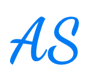

# Markdown

## General

### Line break

A line break is required between 2 lines to make them as paragraphs.

### Horizontal line

A horizontal line can be created using three dashes. Use a line break above it. Otherwise, if there is text above it, the parser assumes it to be a header.

**Example:**

---

## Code

We can use three backticks followed by name of the language that we're using code block of. Once we're done with code snippet, we can end the code section area by three backticks.

```javascript
let counter = 0;
console.log(counter);
```

Inline code can be used with surrouding code in a pair of single backtick.

**Example:**

Use `let counter = 0;` in line 54.

We can also use markdown code snippets for diffs.

**Usage:**

```diff
let x = 100;
- let y = 200;
+ let y  = 225;
let z  = 300;
```

## Elements

### Checkbox

A checkbox can be created by using a bullet point followed by pair of square brackets with one space between them.

- [ ] Checkbox item 1
- [ ] Checkbox item 2

If we use x between in the opening and closing of square brackets, then the checkbox will be checked.

- [x] Checkbox item 1
- [x] Checkbox item 2

### Images

The syntax for using an image in markdown as follows:


**Example:**



A tocken (any alpha numeric string) can be used if the image link needs to be used in multiple places.

![Aukha Saukha logo][logo]

[logo]: img/aukha-saukha-163 × 134.png

### Heading

Use the following without the double quotes.

For h1, use "#"

For h2, use "##"

For h3, use "###"

For h4, use "####"

For h5, use "#####"

For h6, use "######"

### Link

Use angle brackets around the link to make it clickable.

**Example:**

Aukha Saukha: <https://aukhasaukha.com>

If we want to use a name for the link, then it can be accomplished by wrapping the name in square brackets, immediately followed by a pair of parenthesis, and put the link inside the parenthesis.

**Example:**

[Aukha Saukha](https://aukhasaukha.com)

If we want to add a title to the link so that when we hover over it, the title text shows up, we can put single space followed by the title text in quotes after the link.

**Example:**

[Aukha Saukha](https://aukhasaukha.com 'Aukha Saukha link')

If a link is used in multiple instances, then we can use a token for it. A tocken (any alpha numeric string) can be created by adding another pair of square bracket after the name square bracket. We can add the defination of the tocken anywhere in the markdown.

This approach is also recommended for the readability purpose if the link is too long.

**Example:**

[Aukha Saukha][1]

[1]: https://aukhasaukha.com

### Order/unordered list

An unordered list can be created by using an astrick, a dash, or a plus sign. However, as a convention we're only going to use astrick for the sake of consistency.

- Bullet point

An order list can be created using a number followed by a dot.

1. Ordered point 1
2. Ordered point 2
3. Ordered point 3

Pro tip: Number 1 followed by dot can be used by all the bullet points, and the parser will automatically increase the ordered list number on its own. The advantage is, if we decide to add another list item in the middle, we'll not have to re-number all the list items that appear after the new point we just added.

1. Ordered point 1
1. Ordered point 2
1. Ordered point 3

A list (both ordered and unordered) can be nested by indenting the child item one more time.

- Menu item 1
  - Sub menu item 1
  - Sub menu item 2
- Menu item 2

### Table

A table can be created by surrounding header and row/column values with pipes. The second row needs be single colon and dashes surrounned by a pair of pipes.

| Table header 1 | Table header 2 |
| :------------- | :------------- |
| 21             | 22             |
| 31             | 32             |

If the 2nd row has colons on both sides, then the text will be center aligned.

| Table header 1 | Table header 2 |
| :------------: | :------------: |
|       21       |       22       |
|       31       |       32       |

Similarily, if there is only one colon which on the right, the text will be right aligned.

## Text Formatting

### Bold

If we surround a word or phrase with 2 sets of astricks or underscores, the word or phrase will become **bold**. Markdown allows 2 sets of underscore too to make text **bold**. However, we're going to use 2 sets of astrick for consistency.

### Italic

If we surround a word or phrase with an astrick or an underscore, the word or phrase will be _italic_. Markdown allows underscore too to make text _italic_. However, we're going to use single astrick for consistency.

### Strike Through

If we surround any text with 2 sets of tildes i.e. ~, there'll be a ~~strike through~~ line above the text.
